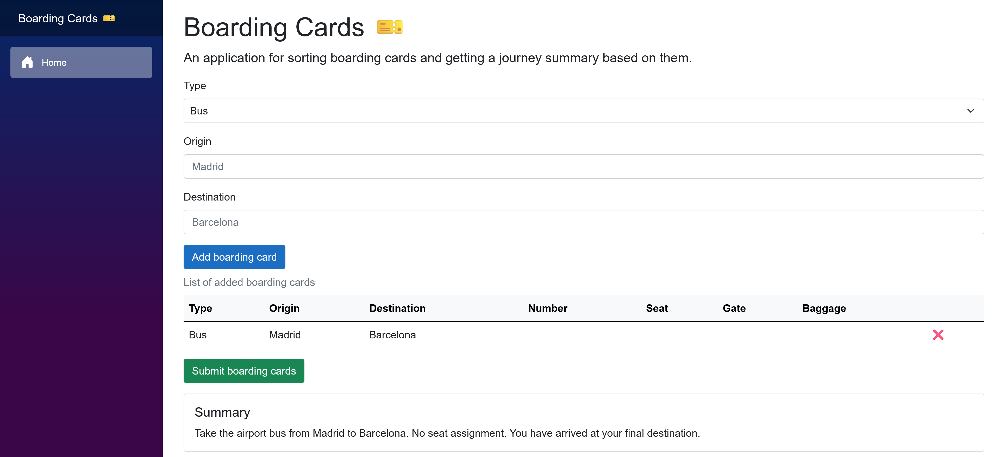
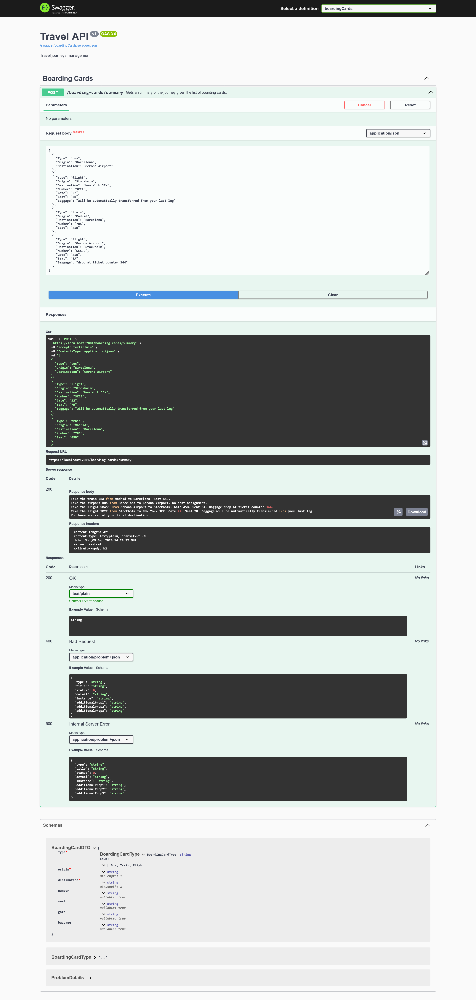

# Boarding Cards
ASP.NET 8 Web API that puts boarding cards in order 🎫 and returns a summary of the given journey 🧳

## Structure
- _**Domain**_ - entities, enums, interfaces and exceptions;
- _**Application**_ - use cases with **MediatR**, validation with **FluentValidation** and services;
- _**API**_ - Minimal API with **Swagger UI**, **Swashbuckle** and **Carter**;
- _**Tests**_ - Unit tests with **xUnit** and **FluentAssertions**;
- _**Blazor**_ - Blazor Web App (Server) that consumes the API (work in progress 🚧);

## Task
You are given a stack of boarding cards for various transportations that will take you from point A to point B via several stops on the way. All of the boarding cards are out of order and you don't know where your journey starts, nor where it ends. Each boarding card contains information about seat assignment, and means of transportation (such as flight number, bus number etc).

Write an API that lets you sort this kind of list and present back a description of how to complete your journey.

For instance the API should be able to take an unordered set of boarding cards, provided in a format defined by you, and produce this list:

- Take train 78A from Madrid to Barcelona. Sit in seat 45B.
- Take the airport bus from Barcelona to Gerona Airport. No seat assignment.
- From Gerona Airport, take flight SK455 to Stockholm. Gate 45B, seat 3A. Baggage drop at ticket counter 344.
- From Stockholm, take flight SK22 to New York JFK. Gate 22, seat 7B. Baggage will be automatically transferred from your last leg.
- You have arrived at your final destination.

The list should be defined in a format that's compatible with the input format.

## Screenshots

### Blazor

### Swagger UI
